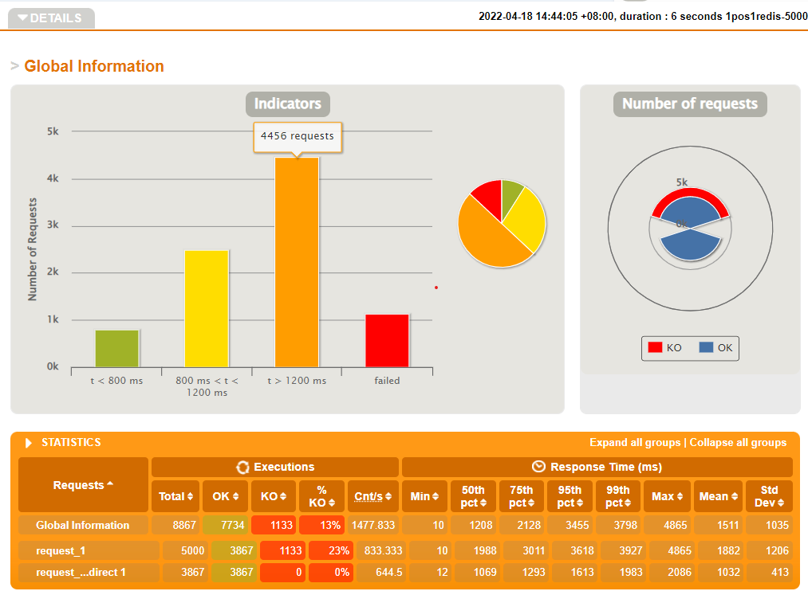
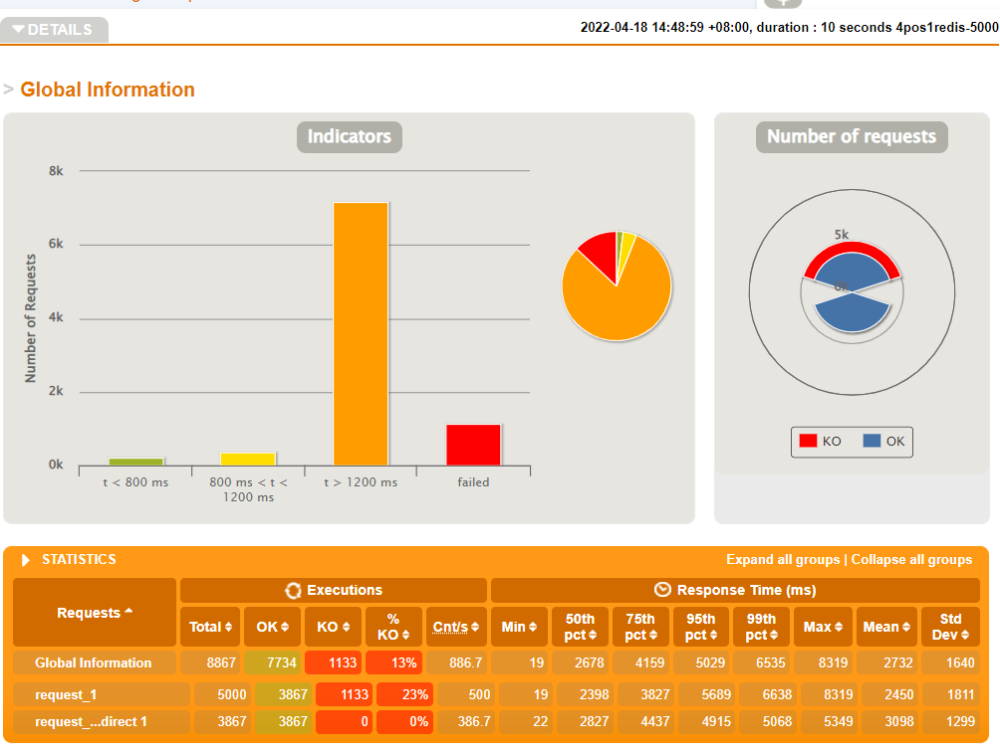
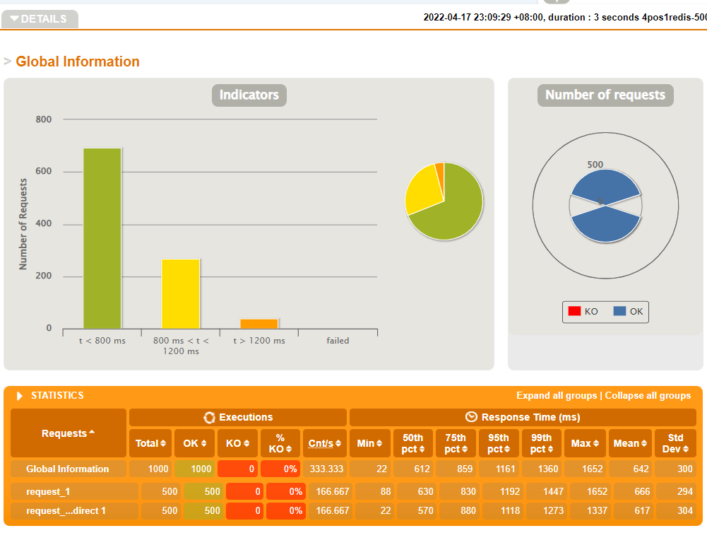
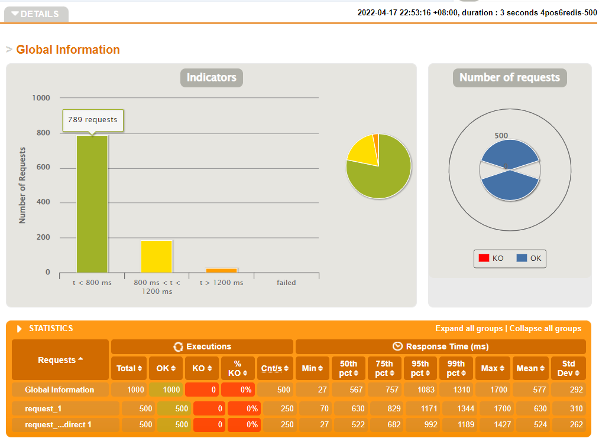

# Plain

basic functions with cache/session (redis)

```
// start your redis & config your application.properties 
mvn clean spring-boot:run
```

# with haproxy and redis cluster

```
# connect to host redis(not cluster): extra-hosts & change protected mode

https://stackoverflow.com/questions/19091087/open-redis-port-for-remote-connections
https://stackoverflow.com/questions/40678865/how-to-connect-to-remote-redis-server
https://stackoverflow.com/questions/48546124/what-is-linux-equivalent-of-host-docker-internal
```

redis cluster: at least 3 master. Don't know why it works :(, there was some issue between spring & redis cluster (MOVED error & CANNOT find partition). But it finally works with no reason.

```
mvn clean package
docker-compose build --no-cache
docker-compose up
```

# gatling

load testing

```
wget https://repo1.maven.org/maven2/io/gatling/highcharts/gatling-charts-highcharts-bundle/3.7.6/gatling-charts-highcharts-bundle-3.7.6-bundle.zip
```

测试了1pos1redis/4pos1redis/4pos6redis, 分别在访问量50/500/1500的情况。运算量都在CPU可控范围内，

## 1pos1redis & 4pos1redis

1pos1redis看起来性能是最好的... 可能是因为用`cpu_count=1`作为资源限制等于没有限制（没找到具体的含义），所以pos越多性能越差了. 用`cpus`限制资源应当更好. 暂时搁置.





## 4pos1redis & 4pos6redis

4pos1redis各组实验与4pos6redis区别较小（后者略微好一点，<800的比率差不多），认为可能是对单独的redis与6个redis没有做性能限制的缘故，而6redis能运用一定的多核性能，所以好一点。






# dep

docker-compose:

```
sudo curl -L "https://github.com/docker/compose/releases/download/1.29.2/docker-compose-$(uname -s)-$(uname -m)" -o /usr/local/bin/docker-compose
sudo chmod +x /usr/local/bin/docker-compose
sudo ln -s /usr/local/bin/docker-compose /usr/bin/docker-compose
docker-compose --version
```

pay attention to bridge network (related with `application.properties`)

use redis-cli:

```
redis-cli -c [-h redis1] [-p port]
> CLUSTER NODES
> keys *
> SET mykey "hello"
> get mykey
```

# 未解决的问题

1. 在一次5000流量的压力测试后，wsl的端口就和win的localhost的端口不绑定了. 可能重启会好. 代替方案是在wsl中做压力测试，并使用局域网ip.
2. 发现docker-compose启动时，偶发spring 通信 redis cluster 的错误（找不到partition），此时进入spring的docker去连redis cluster，check和set都没有问题. 想不清楚具体的原因，可能是pos比某个redis更早地被启用了，然后spring没有尝试重新建立连接，这个问题没有解决.

***


```
docker-compose up [-d] --force-recreate --renew-anon-volumes # not use old image

docker-compose pull
docker-compose up

docker-compose down -v
docker-compose build --no-cache
... should not build with cache
```

> Some network issues...

